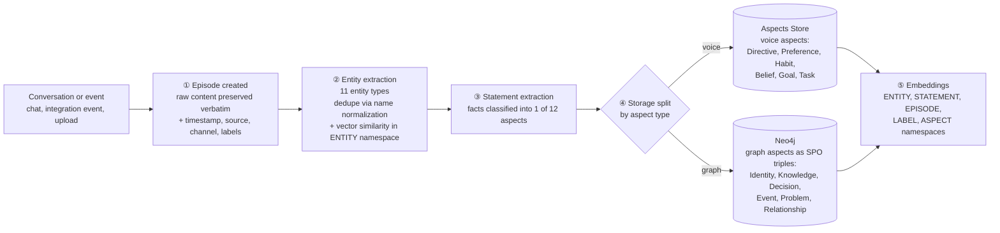

## Pipeline overview

Ingestion turns raw content into structured primitives: `Episode`, `Entity`, `Statement`. Statements are classified by aspect, then routed to one of two stores. Embeddings are written alongside for retrieval.



Both stores link back to the source `Episode`, so any retrieved fact can be traced to the original content.

## Stage 1: Episode creation

Raw content becomes an `Episode`. The original text is preserved verbatim as the source of truth.

Metadata captured at this stage:
- `timestamp`: when the content occurred
- `source`: integration or entry point (Slack, GitHub, Gmail, Butler, MCP, upload)
- `channel`: sub-source identifier (channel name, repo, thread)
- `labels`: applied automatically based on context, or set by the agent at ingestion time

## Stage 2: Entity extraction

CORE extracts entities from the episode and assigns each one of 11 types (see [entity types](/memory/entity_types)): `Person`, `Organization`, `Place`, `Event`, `Project`, `Task`, `Technology`, `Product`, `Standard`, `Concept`, `Predicate`.

Deduplication runs in two passes:
1. Name normalization, so "Sarah", "sarah", "@sarah" collapse.
2. Vector similarity in the `ENTITY` namespace, so "Sarah Chen" and "Sarah" resolve when context confirms a match.

The resolved entity becomes the canonical node referenced by all later statements.

## Stage 3: Statement extraction

Facts are extracted from the episode as discrete statements. Each statement is classified into one of 12 aspects (see [aspects](/memory/aspects)): `Identity`, `Knowledge`, `Belief`, `Preference`, `Habit`, `Goal`, `Task`, `Directive`, `Decision`, `Event`, `Problem`, `Relationship`.

The aspect determines where the statement is stored in the next stage.

## Stage 4: Storage

CORE splits statements across two stores based on aspect:

**Voice aspects** go to the Aspects Store as complete, non-decomposed statements: `Directive`, `Preference`, `Habit`, `Belief`, `Goal`, `Task`. These represent what the user speaks (rules, preferences, beliefs, goals, habits, tasks) and are kept whole so the original phrasing survives.

**Graph aspects** go to Neo4j as subject-predicate-object (SPO) triples: `Identity`, `Knowledge`, `Decision`, `Event`, `Problem`, `Relationship`. Decomposition into triples enables structured graph traversal and relationship queries.

Both stores link every statement back to the source `Episode`, preserving provenance.

## Stage 5: Embeddings

During ingestion, embeddings are written to five vector namespaces:

- `ENTITY`: entity dedupe and resolution
- `STATEMENT`: statement dedupe and similarity search
- `EPISODE`: episode similarity, used as a fallback path in retrieval
- `LABEL`: label matching during search routing
- `ASPECT`: aspect dedupe in the Aspects Store

V2 search uses these for label routing, entity resolution, and similarity fallback when graph traversal does not return a direct hit.

## Conflict handling

### Entity resolution

When the same person or concept appears under different surface forms ("Sarah", "Sarah Chen", "@sarah", "sarah@company.com"), CORE resolves them to a single entity using name normalization plus vector similarity in the `ENTITY` namespace. Searching for "Sarah" surfaces everything connected to her, not just exact name matches.

### Contradiction handling

When a new statement contradicts an existing one, CORE does not overwrite. It creates a temporal chain: the old statement gets an `invalidAt` timestamp, and the new statement becomes current. Search returns the current state by default, with history accessible: "Currently prefers GraphQL (as of Feb 10), previously preferred REST."

## Worked example

Input episode:

```
Episode (Slack DM, 2026-02-10):
"Sarah and I decided to use Neo4j for the new graph service.
 I prefer pnpm over npm because of better TypeScript support."
```

Extracted entities:
- `Sarah`: `Person`
- `Neo4j`: `Technology`
- `pnpm`: `Technology`
- `npm`: `Technology`
- `TypeScript`: `Technology`

Extracted statements:
- `Decision`: "Use Neo4j for the new graph service" → graph aspect, stored in Neo4j as an SPO triple
- `Preference`: "Prefers pnpm over npm" → voice aspect, stored in the Aspects Store
- `Belief`: "pnpm has better TypeScript support" → voice aspect, stored in the Aspects Store

All three statements link back to the same source `Episode`, so retrieval can return the original Slack DM as evidence.

## Ingestion entry points

- **Automatic via integrations**: GitHub, Slack, Linear, Gmail, and other connected apps stream events into ingestion in real time or via scheduled syncs.
- **Butler conversations**: chats with the Butler are auto-ingested.
- **Manual dashboard upload**: drop documents or paste content directly.
- **Programmatic via MCP**: any connected AI agent can call the `memory_ingest` tool to push raw content.

## Related

- [How CORE Searches](/memory/how-core-searches)
- [Statement aspects](/memory/aspects)
- [Entity types](/memory/entity_types)
- [Labels](/memory/labels)
