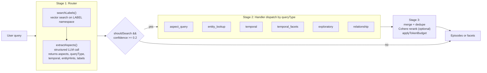

## Pipeline overview

CORE V2 search routes a query through two stages before any episode retrieval: a vector lookup against topic labels, then a structured LLM call that extracts aspects, query type, temporal scope, and entity hints. A handler is dispatched per `queryType`. Results are merged, optionally reranked, and trimmed to a token budget.



## Stage 1: Intent routing

The router lives in `apps/webapp/app/services/search-v2/router.ts` and runs two sequential steps.

First, `searchLabels()` embeds the query and runs vector search against the `LABEL` namespace. The similarity threshold comes from `SEARCH_LABEL_VECTOR_THRESHOLD`. Matched labels are returned as `matchedLabels`.

Second, `extractAspects()` calls an LLM with the query and the matched labels as context. The LLM returns a structured object:

```json
{
  "aspects": ["string"],
  "queryType": "aspect_query | entity_lookup | temporal | temporal_facets | exploratory | relationship",
  "temporal": {
    "type": "string",
    "days": 0,
    "startDate": "string | null",
    "endDate": "string | null"
  },
  "shouldSearch": true,
  "entityHints": ["string"],
  "selectedLabels": ["string"],
  "lookupMode": "attribute | broad",
  "attributeHint": "string | null",
  "facets": ["string"],
  "confidence": 0.0
}
```

The full router result also includes `matchedLabels` (from the label vector search) and `routingTimeMs`.

`shouldProceedWithSearch()` short-circuits the pipeline when `shouldSearch === false` or `confidence < 0.2`. In that case no handler runs and an empty result is returned.

## Stage 2: Handler dispatch

Handlers live in `apps/webapp/app/services/search-v2/handlers.ts`. Dispatch is by `queryType`.

### `aspect_query`

Triggered when the query is about a topic, behavior, or category (for example "my views on remote work"). `handleAspectQuery` runs three calls in parallel:

- `getEpisodesForAspect`: graph query scoped by `labelIds`, `aspects`, and temporal range.
- `getEpisodesViaEntityHints`: resolves each entity hint via vector search on the `ENTITY` namespace, then fetches episodes from the graph.
- `getEpisodesViaVectorSearch`: vector search on episode embeddings, only when `labelIds.length === 0` (no label match to scope by).

Returns a deduped list of episodes.

### `entity_lookup`

Triggered when the query targets a specific entity (for example "what is my wife's name"). `handleEntityLookup` resolves each entry in `entityHints` via vector search on the `ENTITY` namespace. Then it branches on `lookupMode`:

- `attribute`: returns the entity with the requested attribute, using `attributeHint` to select the field.
- `broad`: returns episodes that mention the entity.

Returns either an entity record with a specific attribute or a list of episodes.

### `temporal`

Triggered when the query has an explicit time scope (for example "what did I do last week"). `handleTemporal` runs in parallel:

- `getEpisodesForTemporal`: graph query scoped by `labelIds` and the temporal range.
- Entity-hint path: vector on `ENTITY`, then graph fetch, with the time filter applied to results.
- Vector fallback: episode vector search, with the time filter applied.

Returns deduped episodes within the time range.

### `temporal_facets`

Triggered when the query asks for an aggregate over a time range (for example "what topics did I discuss this month"). `handleTemporalFacets` aggregates facets (topics, entities, aspects) over the range and returns counts. It does not return episodes.

### `exploratory`

Triggered for broad recall queries (for example "summarize recent work"). `handleExploratory` queries the `Document` table for compacted session rows scoped by `labelIds`. It also runs the entity-hint path and the vector fallback in parallel.

Returns compacted session documents plus any matching episodes.

### `relationship`

Triggered when the query connects two or more entities (for example "how do Alice and Bob know each other"). `handleRelationship` requires `entityHints.length >= 2`. Each hint is resolved via vector search on the `ENTITY` namespace, then graph traversal finds connecting statements.

Returns statements that link the entities.

## Stage 3: Merge, rerank, budget

After a handler returns:

1. Merge and dedupe episodes across the parallel sub-results.
2. If `options.enableReranking` is true, `applyCohereEpisodeReranking` reorders episodes using a Cohere rerank model.
3. `applyTokenBudget` trims the episode list to fit the configured token limit, preserving rerank order.

The final payload contains the trimmed episode list, any entity or facet results from the handler, and routing metadata.

## Worked examples

### Aspect query

Input: `"what is my view on code review"`.

Router output (compact):

```json
{
  "queryType": "aspect_query",
  "aspects": ["preferences", "opinions"],
  "selectedLabels": ["engineering", "code-review"],
  "entityHints": [],
  "shouldSearch": true,
  "confidence": 0.82
}
```

Handler: `handleAspectQuery` runs `getEpisodesForAspect` scoped by the resolved `labelIds` and aspects. No entity hints, so the entity path is skipped. Because labels matched, the vector fallback is skipped.

Returns: deduped episodes about code review preferences.

### Entity lookup, attribute mode

Input: `"what is my wife's birthday"`.

Router output:

```json
{
  "queryType": "entity_lookup",
  "entityHints": ["wife"],
  "lookupMode": "attribute",
  "attributeHint": "birthday",
  "aspects": [],
  "shouldSearch": true,
  "confidence": 0.91
}
```

Handler: `handleEntityLookup` resolves `"wife"` via vector search on the `ENTITY` namespace, then returns the matched entity with the `birthday` attribute populated.

Returns: an entity record with the requested attribute.

### Temporal query

Input: `"what did I work on last week"`.

Router output:

```json
{
  "queryType": "temporal",
  "temporal": { "type": "relative", "days": 7, "startDate": null, "endDate": null },
  "selectedLabels": ["work"],
  "entityHints": [],
  "aspects": ["activities"],
  "shouldSearch": true,
  "confidence": 0.78
}
```

Handler: `handleTemporal` runs `getEpisodesForTemporal` scoped by `labelIds` and the seven day range, plus the vector fallback with the same time filter applied.

Returns: deduped episodes within the last seven days.

## V1 fallback

Workspace versioning is checked in `apps/webapp/app/services/agent/memory.ts`. When `workspace.version === "V3"`, only V2 runs. For any other version, V2 runs first and the legacy V1 path runs as a fallback when V2 returns empty. V1 uses BM25, vector search, and BFS graph traversal.

V2 itself does not use BM25. All V2 retrieval is graph plus vector.

## Related concepts

- [Query types](/memory/query_types)
- [Statement aspects](/memory/aspects)
- [Entity types](/memory/entity_types)
- [Labels](/memory/labels)
- [How CORE ingests](/memory/how-core-ingests)
